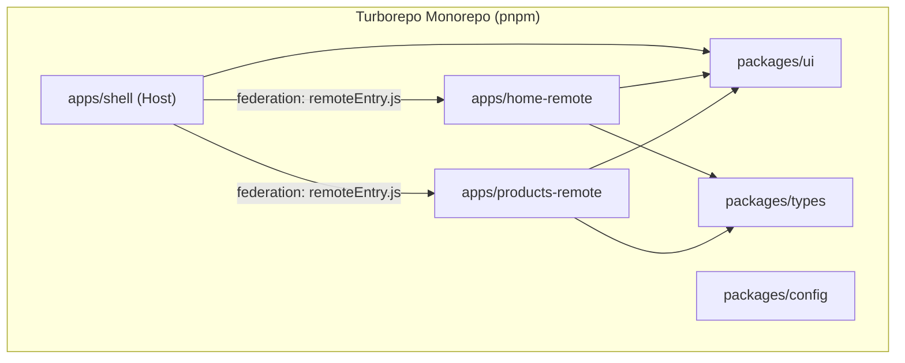

# Ionic + React MFE Monorepo with Turborepo — Design Spec

**Date:** 2026-07-01  
**Status:** Approved  
**Purpose:** Proof-of-concept for stakeholders — validate micro-frontend architecture with Ionic, React, Vite Module Federation, and Turborepo.

---

## Goals

Demonstrate a single-source monorepo where:

1. A **shell (host)** Ionic React app loads **two remote micro-frontends** at runtime via Module Federation.
2. **Shared packages** (UI components, types) are consumed by all apps without duplication.
3. **Turborepo** orchestrates dev/build/lint with caching and correct dependency ordering.
4. The structure is **Capacitor-ready** (Ionic build output, config stubs) but does not generate native projects in this PoC.

## Non-Goals

- Native iOS/Android builds or device testing
- CI/CD pipelines
- Authentication, real APIs, or global state management
- Production deployment (CDN hosting of remote bundles)
- More than two remote MFEs

---

## Architecture



### Apps

| App | Role | Dev Port | Federation Export | Shell Route |
|-----|------|----------|-------------------|-------------|
| `apps/shell` | Host — Ionic tabs/router, loads remotes | 3000 | — | owns `/`, `/products` |
| `apps/home-remote` | Remote — welcome/dashboard | 3001 | `./HomeApp` | mounted at `/` |
| `apps/products-remote` | Remote — product list | 3002 | `./ProductsApp` | mounted at `/products` |

### Shared Packages

| Package | Responsibility |
|---------|----------------|
| `packages/ui` | Shared Ionic-styled components (`Button`, `PageLayout`), theme tokens |
| `packages/types` | Shared TypeScript interfaces (`Product`, etc.) |
| `packages/config` | Shared `tsconfig`, ESLint presets extended by all apps |

---

## Repository Layout

```
ionic-mfe-turbo/
├── apps/
│   ├── shell/
│   │   ├── src/
│   │   ├── vite.config.ts        # federation host config
│   │   ├── capacitor.config.ts   # stub, Capacitor-ready
│   │   └── package.json
│   ├── home-remote/
│   │   ├── src/
│   │   ├── vite.config.ts        # federation remote config
│   │   ├── capacitor.config.ts
│   │   └── package.json
│   └── products-remote/
│       ├── src/
│       ├── vite.config.ts
│       ├── capacitor.config.ts
│       └── package.json
├── packages/
│   ├── ui/
│   ├── types/
│   └── config/
├── turbo.json
├── pnpm-workspace.yaml
├── package.json
└── README.md
```

---

## Technical Decisions

### Package Manager

**pnpm workspaces** — efficient disk usage, strict dependency resolution, Turborepo default recommendation.

### Build Tool & Federation

- **Vite** per app (Ionic React standard)
- **`@module-federation/vite`** — official Module Federation plugin for Vite
- Shell is the **host**; `home-remote` and `products-remote` are **remotes**
- Each remote exposes a single entry component (`HomeApp`, `ProductsApp`) consumed by the shell

### Shared Singletons (Federation)

These dependencies must be configured as **singletons** in federation config to prevent duplicate instances:

- `react`
- `react-dom`
- `react-router-dom`
- `@ionic/react`
- `@ionic/react-router`

All apps must use the **same versions** (enforced via root `package.json` or pnpm overrides).

### Routing

- Shell owns the top-level **Ionic React Router** with tab navigation
- Tab "Home" → lazy-loads `home-remote/HomeApp` via federation
- Tab "Products" → lazy-loads `products-remote/ProductsApp` via federation
- Remotes do not define their own top-level routers in the PoC (shell controls navigation)

### Capacitor-Ready (Not Wired)

Each app includes:

- `capacitor.config.ts` with `webDir` pointing to Vite build output (`dist`)
- `ionic build` script in `package.json`
- README section documenting future path: `ionic build` → `npx cap add ios/android`

No `ios/` or `android/` directories are generated in this PoC.

### Turborepo Pipelines

```json
{
  "tasks": {
    "build": { "dependsOn": ["^build"], "outputs": ["dist/**"] },
    "dev": { "cache": false, "persistent": true },
    "lint": { "dependsOn": ["^build"] }
  }
}
```

Root `pnpm dev` runs all three apps concurrently via Turbo.

---

## Stakeholder Demo Flow

1. Run `pnpm install && pnpm dev` from repo root
2. Open `http://localhost:3000` (shell)
3. **Home tab** — remote loads at runtime; DevTools Network shows `remoteEntry.js` from port 3001
4. **Products tab** — second remote loads from port 3002
5. Both remotes render the shared `Button` from `packages/ui` with identical styling
6. README explains architecture diagram and Capacitor path

---

## Success Criteria

- [ ] `pnpm install && pnpm dev` starts shell + both remotes without errors
- [ ] Shell loads Home and Products remotes at runtime via Module Federation
- [ ] Shared `packages/ui` component renders correctly in both remotes
- [ ] Turbo caches `build` tasks; second build is faster
- [ ] README documents architecture for stakeholder review
- [ ] Each app has Capacitor config stub (no native builds required)

---

## Risks & Mitigations

| Risk | Mitigation |
|------|------------|
| Duplicate React/Ionic instances break hooks | Federation shared singleton config + pnpm version alignment |
| Dev-mode CORS between host/remotes | Configure Vite `server.cors: true` and explicit dev origins |
| Federation plugin instability | Pin `@module-federation/vite` to a known working version |
| Ionic + Vite federation edge cases | Keep remote exports as simple React components; shell handles Ionic shell UI |

---

## Alternatives Considered

| Approach | Why Not Chosen |
|----------|----------------|
| Nx + Module Federation | Heavier tooling; overkill for PoC |
| Build-time package imports | Not true runtime MFE; weaker stakeholder story |
| single-spa | Extra orchestration layer; Vite federation is more idiomatic for React |

**Selected:** pnpm + Turborepo + `@module-federation/vite`
